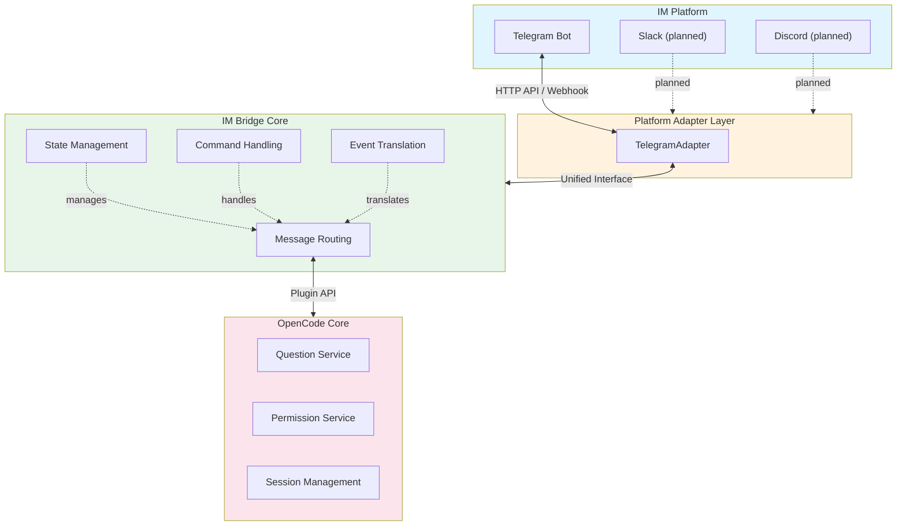

# OpenCode IM Bridge

通用的 IM 桥接插件，让 OpenCode 与各种即时通讯平台双向通信。

## 功能特性

- **双向通信**: 从 IM 接收问题、发送回复，向 OpenCode 发送消息
- **权限审批**: 在 IM 中审批 OpenCode 的权限请求
- **会话管理**: 查看活动会话、切换会话、向指定会话发送消息
- **Markdown 渲染**: 自动将 Markdown 转换为 Telegram HTML，支持表格、代码块等
- **多平台支持**: Telegram、Slack、Discord（可扩展）
- **灵活配置**: 自定义消息模板、权限控制、功能开关

## 支持的 IM 平台

| 平台 | 状态 | 特性 |
|------|------|------|
| Telegram | ✅ 可用 | 按钮、Markdown→HTML 转换、表格支持、Webhook/Long Polling |
| Slack | 🚧 计划中 | Block Kit、Slash Commands |
| Discord | 🚧 计划中 | 内嵌按钮、Rich Embed |

## 快速开始

### 1. 安装插件

```bash
# 在 opencode 项目中
npm install opencode-im-bridge

# 或在 .opencode 目录
opencode plugin add opencode-im-bridge
```

### 2. 创建 Telegram Bot

1. 在 Telegram 中找到 [@BotFather](https://t.me/BotFather)
2. 发送 `/newbot` 创建新机器人
3. 获取 Bot Token
4. 发送 `/start` 给自己创建的机器人
5. 获取你的 Chat ID（可以通过 [@userinfobot](https://t.me/userinfobot)）

### 3. 配置插件

在 `.opencode/config.json` 中添加：

```json
{
  "plugin": [
    ["opencode-im-bridge", {
      "platform": "telegram",
      "platformConfig": {
        "botToken": "YOUR_BOT_TOKEN",      // 从 @BotFather 获取
        "chatId": "YOUR_CHAT_ID"           // 你的 Telegram 用户 ID
      },
      "bridgeConfig": {
        // 可选：管理员用户 ID 列表（为空表示允许所有用户）
        "adminUsers": ["YOUR_USER_ID"],
        
        // 可选：功能开关
        "features": {
          "questions": true,        // 接收 AI 问题通知（默认：true）
          "permissions": true,      // 接收权限请求通知（默认：true）
          "directMessaging": true   // 允许通过 /ask 发送消息（默认：true）
        }
      }
    }]
  ]
}
```

### 4. 启动 OpenCode

```bash
opencode
```

现在当 OpenCode 需要确认时，你会在 Telegram 收到消息！

## 配置详解

### 平台配置

#### Telegram

```typescript
{
  botToken: string      // Bot Token from @BotFather
  chatId: string        // Target chat ID (can be group chat)
  webhookUrl?: string   // Optional: webhook URL
  webhookPort?: number  // Optional: webhook server port
}
```

**Webhook vs Long Polling**
- 开发环境：默认使用 Long Polling，无需配置
- 生产环境：使用 Webhook 更高效
  ```json
  {
    "webhookUrl": "https://your-server.com/webhook",
    "webhookPort": 3000
  }
  ```

### 桥接配置 (bridgeConfig)

```typescript
{
  /** 
   * 管理员用户 ID 列表
   * 只有这些用户可以使用 Bot 命令（/sessions, /ask 等）
   * 为空数组或不设置则表示允许所有用户
   */
  adminUsers?: string[]
  
  /** 
   * 允许的聊天/群组 ID 列表
   * 只有这些聊天中的消息会被处理
   * 为空数组或不设置则表示允许所有聊天
   */
  allowedChats?: string[]
  
  /** 
   * 自定义消息模板
   * 可以自定义 question、permission、help 消息的格式
   */
  templates?: {
    /** 问题通知模板 */
    question?: (info: QuestionInfo) => string
    /** 权限请求模板 */
    permission?: (info: PermissionInfo) => string
    /** 帮助信息模板 */
    help?: () => string
  }
  
  /** 
   * 功能开关
   * 控制插件的各项功能是否启用
   */
  features?: {
    /** 启用 AI 问题通知（当 AI 需要确认时推送消息） */
    questions?: boolean
    /** 启用权限请求通知（当 AI 需要权限时推送消息） */
    permissions?: boolean
    /** 启用直接消息（允许使用 /ask 命令向会话发送消息） */
    directMessaging?: boolean
  }
}
```

**会话自动选择机制：**
当你使用 `/ask` 命令但没有通过 `/use` 选择会话时，系统会自动使用**最新的活动会话**（按更新时间排序的第一个会话）。建议先使用 `/sessions` 查看活动会话，然后使用 `/use <sessionId>` 选择特定会话。

## Telegram 命令

在 Telegram 中使用以下命令：

| 命令 | 描述 |
|------|------|
| `/help` | 显示帮助信息 |
| `/sessions` | 列出活动会话（busy/retry/1h内） |
| `/current` | 查看当前选中的会话 |
| `/use <id>` | 选择特定会话 |
| `/ask <message>` | 向当前会话发送消息 |

## 工作流程

### 场景 1: AI 需要确认方案

```
OpenCode: 生成 Plan
    ↓
需要用户选择方案 A/B/C
    ↓
发送 Telegram 消息（带按钮）
    ↓
用户点击按钮
    ↓
Telegram → OpenCode (question.reply)
    ↓
OpenCode 继续执行
```

### 场景 2: 权限审批

```
OpenCode: 要编辑文件
    ↓
需要 edit 权限
    ↓
发送 Telegram 消息（允许/拒绝按钮）
    ↓
用户选择 "允许一次"
    ↓
Telegram → OpenCode (permission.reply)
    ↓
OpenCode 执行编辑
```

### 场景 3: 主动查询和发送

```
用户: /sessions
    ↓
Telegram → OpenCode (session.list)
    ↓
返回活动会话列表（带选择按钮）

用户: /use <sessionId>
    ↓
选择特定会话

用户: /ask 现在进度如何？
    ↓
Telegram → OpenCode (session.prompt)
    ↓
消息加入会话上下文
    ↓
AI 在下次回复时回答
```

## 自定义适配器

轻松添加新的 IM 平台支持：

```typescript
import type { IMAdapter, IMMessage, IMCallbackQuery, IMOutgoingMessage } from "opencode-im-bridge"

export class MyCustomAdapter implements IMAdapter {
  readonly name = "myplatform"
  readonly version = "1.0.0"
  
  async initialize(config: Record<string, unknown>): Promise<void> {
    // 初始化连接
  }
  
  async sendMessage(message: IMOutgoingMessage): Promise<{ messageId: string }> {
    // 发送消息到 IM 平台
  }
  
  onMessage(handler: (message: IMMessage) => void): void {
    // 设置消息处理器
  }
  
  onCallback(handler: (callback: IMCallbackQuery) => void): void {
    // 设置回调处理器
  }
  
  async start(): Promise<void> {
    // 开始接收消息
  }
  
  async stop(): Promise<void> {
    // 停止接收
  }
}

// 在配置中使用
{
  "platform": "custom",
  "customAdapter": "./my-custom-adapter.js",
  "platformConfig": { ... }
}
```

## 高级用法

### 自定义消息模板

通过 templates 可以自定义各类消息的格式，支持 Markdown 语法：

```json
{
  "templates": {
    "question": "(info) => `🤔 **${info.questions[0].header}**\\n\\n${info.questions[0].question}`",
    "permission": "(info) => `🔒 **权限请求**\\n\\n工具: ${info.permission}`",
    "help": "() => `欢迎使用 IM Bridge`"
  }
}
```

### 多用户权限控制

限制哪些用户可以使用 Bot，以及哪些群组可以接收通知：

```json
{
  // 允许使用 Bot 命令的用户 ID 列表
  "adminUsers": ["123456789", "987654321"],
  
  // 允许接收消息的聊天/群组 ID 列表
  // 群组 ID 通常以 -100 开头
  "allowedChats": ["-1001234567890"]
}
```

### 功能开关

```json
{
  "features": {
    "questions": true,        // 接收问题通知（AI 需要确认时推送）
    "permissions": true,      // 接收权限请求（AI 需要权限时推送）
    "directMessaging": true   // 允许直接发消息（/ask 命令）
  }
}
```

## 架构设计



## 开发计划

- [x] Core bridge architecture
- [x] Telegram adapter
- [x] Markdown to Telegram HTML conversion
- [x] Markdown table support
- [ ] Slack adapter
- [ ] Discord adapter
- [ ] Message queue persistence
- [ ] Rate limiting

## 贡献指南

欢迎贡献新的适配器！请参考：

1. 实现 `IMAdapter` 接口
2. 放在 `src/adapters/` 目录
3. 更新适配器注册表
4. 添加文档和示例

## License

MIT
