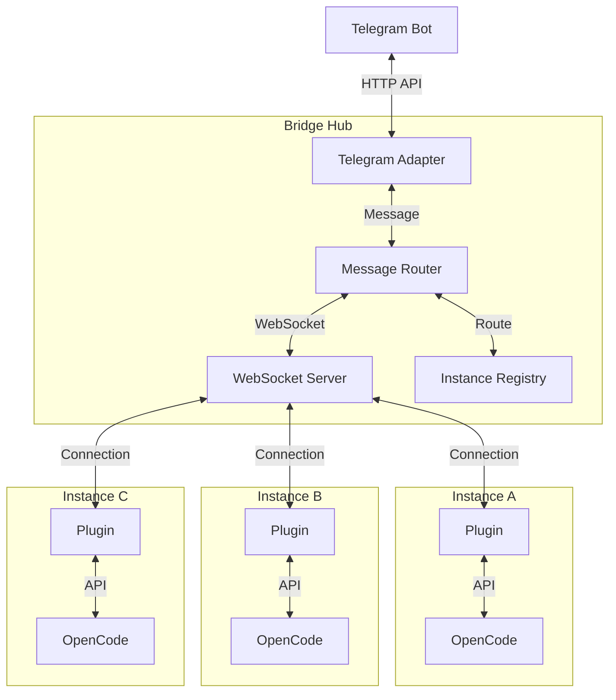

# OpenCode Bridge Hub

集中式 IM 桥接服务，让一个 Telegram Bot 管理多个 OpenCode 实例。

## 架构



### 工作流程

1. **Plugin 连接**：每个 OpenCode 实例启动时，Plugin 作为 WebSocket 客户端连接到 Bridge Hub
2. **用户交互**：用户在 Telegram 中选择实例并发送消息
3. **消息路由**：Bridge Hub 根据用户选择将消息路由到对应实例
4. **响应返回**：OpenCode 处理完成后，响应通过 Bridge Hub 返回给 Telegram

## 目录结构

```
opencode-im-bridge/
├── bridge-hub/              # Bridge Hub 服务端
│   ├── src/
│   │   ├── adapters/
│   │   │   └── telegram.ts        # Telegram 适配器
│   │   ├── core/
│   │   │   └── markdown-entities.ts  # Markdown → Entities 转换
│   │   ├── router/
│   │   │   └── message-router.ts  # 消息路由
│   │   ├── server/
│   │   │   └── websocket-server.ts # WebSocket + 实例注册表
│   │   └── types/
│   │       └── index.ts           # 类型定义
│   └── ...
│
└── opencode-plugin/         # OpenCode Plugin (客户端)
    ├── core/
    │   ├── hub-client.ts          # WebSocket 客户端
    │   └── logger.ts
    ├── types/
    │   └── index.ts
    └── server.ts                  # Plugin 入口
```

## 快速开始

### 1. 部署 Bridge Hub

```bash
cd bridge-hub

# 配置环境变量
cp .env.example .env
# 编辑 .env，设置 TELEGRAM_BOT_TOKEN

# 安装依赖并启动
npm install
npm start
```

启动成功后会看到：
```
🚀 Starting Bridge Hub...
📡 WebSocket port: 38471
👥 Admin users: all users
🤖 Telegram Bot: @YourBotName
🔑 Auth Token: xxxxxxxx
✅ Bridge Hub started successfully!
```

**注意**：如果没有设置 `AUTH_TOKEN`，会自动生成一个并显示在控制台，请记下它。

### 2. 配置 Plugin

在每个 OpenCode 项目的 `.opencode/config.json` 中添加：

```json
{
  "plugin": [
    ["opencode-bridge-client", {
      "hubConfig": {
        "hubUrl": "ws://your-server:38471",
        "authToken": "your-auth-token"
      }
    }]
  ]
}
```

**配置说明**:
- `hubUrl`: Bridge Hub 的 WebSocket 地址（本地测试用 `ws://localhost:38471`）
- `authToken`: 从 Bridge Hub 启动日志中复制的认证令牌
- `instanceId`: 可选，默认自动生成（基于工作目录）

### 3. 启动 OpenCode

```bash
opencode
```

如果连接成功，你会在 Bridge Hub 的控制台看到：
```
Instance registered: project-a-abc123 (/Users/you/project-a)
```

## 配置说明

### Bridge Hub 环境变量

| 环境变量 | 说明 | 默认值 |
|----------|------|--------|
| `PORT` | WebSocket 端口 | 38471 |
| `AUTH_TOKEN` | 认证令牌（可选） | 自动生成 |
| `TELEGRAM_BOT_TOKEN` | Telegram Bot Token (必填) | - |
| `ADMIN_USERS` | 允许的用户 ID 列表（逗号分隔） | 所有用户 |
| `ALLOWED_CHATS` | 允许的 Chat ID 列表（逗号分隔） | 所有 Chat |

### Plugin 配置

| 参数 | 说明 | 必填 |
|------|------|------|
| `hubUrl` | Bridge Hub WebSocket 地址 | 是 |
| `authToken` | 认证令牌 | 是 |
| `instanceId` | 实例 ID（默认自动生成） | 否 |

## Telegram 命令

| 命令 | 描述 |
|------|------|
| `/help` | 显示帮助信息 |
| `/instances` | 列出所有连接的实例 |
| `/use <id>` | 选择指定实例 |
| `/sessions` | 列出当前实例的所有 Sessions |
| `/current` | 查看当前选中的实例和 Session |
| `/cmd` | 打开远程控制面板 |

### 远程控制面板 (/cmd)

| 命令 | 描述 |
|------|------|
| `session new` | 创建新 Session |
| `session compact` | 压缩当前 Session |
| `session interrupt` | 中断当前任务 |
| `autotitle` | AI 自动生成标题 |

## 消息格式

从 Telegram 发送的消息会显示为：

```
instance: xxx
Title: xxx
Session Id: `xxx`

🦀 **蟹老板说**

[AI 响应内容]
```

## 扩展新渠道

要添加新的 IM 平台（如 Slack、Discord）：

1. 实现 `IMAdapter` 接口：

```typescript
import type { IMAdapter, IMMessage, IMCallbackQuery, IMOutgoingMessage } from './types/index.js'

export class SlackAdapter implements IMAdapter {
  readonly name = 'slack'
  readonly version = '1.0.0'
  
  async initialize(config: Record<string, unknown>): Promise<void> {
    // 初始化
  }
  
  async sendMessage(message: IMOutgoingMessage): Promise<{ messageId: string }> {
    // 发送消息
  }
  
  onMessage(handler: (message: IMMessage) => void): void {
    // 设置消息处理器
  }
  
  onCallback(handler: (callback: IMCallbackQuery) => void): void {
    // 设置回调处理器
  }
  
  async start(): Promise<void> {
    // 开始接收消息
  }
  
  async stop(): Promise<void> {
    // 停止
  }
}
```

2. 在 `index.ts` 中使用新的 adapter：

```typescript
const adapter = new SlackAdapter()
await adapter.initialize({ botToken: process.env.SLACK_BOT_TOKEN })
const router = new MessageRouter(registry, adapter, adminUsers)
```

## 文档

- [架构设计](docs/bridge-hub-design-plugin.md) - 详细的架构设计方案
- [本地测试指南](docs/local-testing-guide.md) - 完整的本地测试步骤
- [Markdown Entities 指南](docs/markdown-entities-guide.md) - Markdown 格式转换技术细节

## License

MIT
